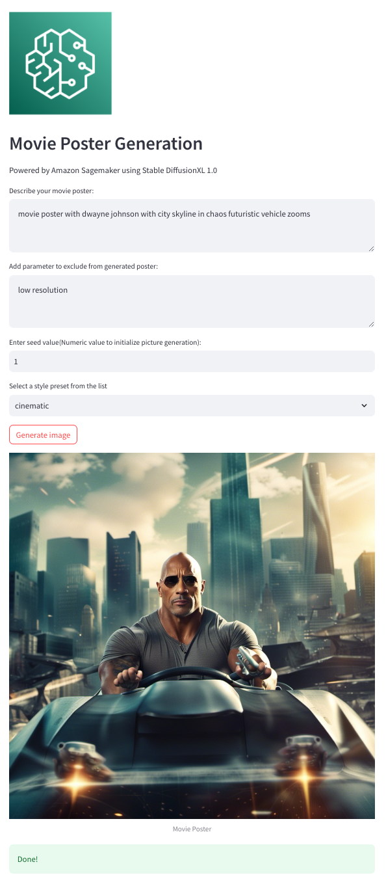
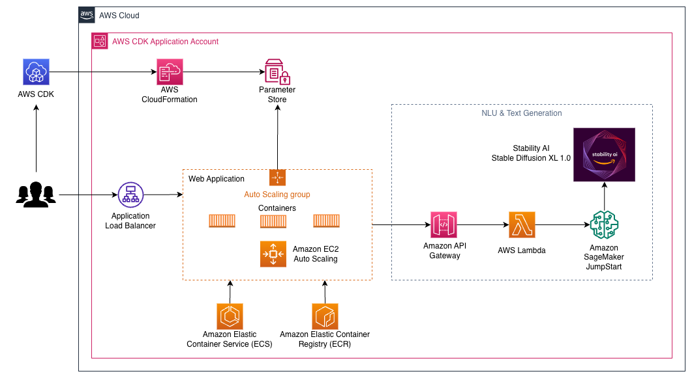

# Generative AI Hackathon - Movie Poster Generator (Media & Entertainment)

- Bennett Borofka - bborofka@
- Carl Luo - carlluo@
- John Brunot - jmbrunot@
- Parvinder Singh - prvinder@

This hackathon demo was developed using the AWS sample for [generative-ai-sagemaker-cdk-demo](https://github.com/aws-samples/generative-ai-sagemaker-cdk-demo).

To generate a movie poster using this demo, you will need to load the website and input your prompt to the following fields:
- **Describe your movie poster**: use a plain, clear description of the kind of poster you want, the actors, type of scene, etc.
- **Add parameter to exclude from generated poster**: add any keywords or phrases of what you **don't** want to appear in the poster.
- **Enter seed value** (default: 1): a randomness value, can be changed to increase the variation of output if creating multiple posters.
- **Select a style preset from the list**: select a theme to give the poster a specific look-and-feel.

Click **Generate** and the poster will generate within about 30 seconds.




## Solution overview

The web application is built on [Streamlit](https://streamlit.io/), an open-source Python library that makes it easy to create and share beautiful, custom web apps for ML and data science. We host the web application using [Amazon Elastic Container Service](https://aws.amazon.com/ecs) (Amazon ECS) with [AWS Fargate](https://docs.aws.amazon.com/AmazonECS/latest/userguide/what-is-fargate.html) and it is accessed via an Application Load Balancer. Fargate is a technology that you can use with Amazon ECS to run [containers](https://aws.amazon.com/what-are-containers) without having to manage servers or clusters or virtual machines. The generative AI model endpoints are launched from JumpStart images in [Amazon Elastic Container Registry](https://aws.amazon.com/ecr/) (Amazon ECR). Model data is stored on [Amazon Simple Storage Service](https://aws.amazon.com/s3/) (Amazon S3) in the JumpStart account. The web application interacts with the models via [Amazon API Gateway](https://aws.amazon.com/api-gateway) and [AWS Lambda](http://aws.amazon.com/lambda) functions as shown in the following diagram.



API Gateway provides the web application and other clients a standard RESTful interface, while shielding the Lambda functions that interface with the model. This simplifies the client application code that consumes the models. The API Gateway endpoints are publicly accessible in this example, allowing for the possibility to extend this architecture to implement different [API access controls](https://docs.aws.amazon.com/apigateway/latest/developerguide/apigateway-control-access-to-api.html) and integrate with other applications.

 

In this post, we walk you through the following steps:

1. Install the [AWS Command Line Interface](http://aws.amazon.com/cli) (AWS CLI) and [AWS CDK v2](https://docs.aws.amazon.com/cdk/v2/guide/getting_started.html) on your local machine.
2. Clone and set up the AWS CDK application.
3. Deploy the AWS CDK application.
4. Use the image generation AI model.
5. Use the text generation AI model.
6. View the deployed resources on the [AWS Management Console](http://aws.amazon.com/console).

We provide an overview of the code in this project in the appendix at the end of this post.


## Prerequisites

You must have the following prerequisites:

- An [AWS account](https://signin.aws.amazon.com/signin)
- The [AWS CLI v2](https://docs.aws.amazon.com/cli/latest/userguide/install-cliv2.html)
- Python 3.6 or later
- node.js 14.x or later
- The [AWS CDK v2](https://docs.aws.amazon.com/cdk/v2/guide/getting_started.html)
- Docker v20.10 or later

 You can deploy the infrastructure in this tutorial from your local computer or you can use [AWS Cloud9](https://aws.amazon.com/cloud9/) as your deployment workstation. AWS Cloud9 comes pre-loaded with AWS CLI, AWS CDK and Docker. If you opt for AWS Cloud9, [create the environment](https://docs.aws.amazon.com/cloud9/latest/user-guide/tutorial-create-environment.html) from the [AWS console](https://console.aws.amazon.com/cloud9).

The estimated cost to complete this post is $50, assuming you leave the resources running for 8 hours. Make sure you delete the resources you create in this post to avoid ongoing charges.


## Install the AWS CLI and AWS CDK on your local machine

If you don’t already have the AWS CLI on your local machine, refer to [Installing or updating the latest version of the AWS CLI](https://docs.aws.amazon.com/cli/latest/userguide/getting-started-install.html) and [Configuring the AWS CLI](https://docs.aws.amazon.com/cli/latest/userguide/cli-chap-configure.html).

Install the AWS CDK Toolkit globally using the following node package manager command:

```
npm install -g aws-cdk-lib@latest
```

Run the following command to verify the correct installation and print the version number of the AWS CDK:

```
cdk --version
```

Make sure you have Docker installed on your local machine. Issue the following command to verify the version:

```
docker --version
```


## Clone and set up the AWS CDK application

On your local machine, clone the AWS CDK application with the following command:

```
git clone https://github.com/cloudbennett/generative-ai-sagemaker-cdk-demo.git
```

Navigate to the project folder:

```
cd generative-ai-sagemaker-cdk-demo
```


The `stack` folder contains the code for each stack in the AWS CDK application. The `code` folder contains the code for the Amazon Lambda functions. The repository also contains the web application located  under the folder `web-app`. 

The `cdk.json` file tells the AWS CDK Toolkit how to run your application.

This application was tested in the `us-east-1` Region but it should work in any Region that has the required services and inference instance type `ml.g4dn.4xlarge` specified in [app.py](app.py). 


#### Setup a virtual environment

This project is set up like a standard Python project. Create a Python virtual environment using the following code:

```
python3 -m venv .venv
```

Use the following command to activate the virtual environment:

```
source .venv/bin/activate
```

If you’re on a Windows platform, activate the virtual environment as follows:

```
.venv\Scripts\activate.bat
```

After the virtual environment is activated, upgrade pip to the latest version:

```
python3 -m pip install --upgrade pip
```

Install the required dependencies:

```
pip install -r requirements.txt
```

Before you deploy any AWS CDK application, you need to bootstrap a space in your account and the Region you’re deploying into. To bootstrap in your default Region, issue the following command:

```
cdk bootstrap
```

If you want to deploy into a specific account and Region, issue the following command:

```
cdk bootstrap aws://ACCOUNT-NUMBER/REGION
```

For more information about this setup, visit  [Getting started with the AWS CDK](https://docs.aws.amazon.com/cdk/latest/guide/getting_started.html).


#### AWS CDK application stack structure

You can list stacks in your CDK application with the following command:

```bash
$ cdk list

GenerativeAiVpcNetworkStack
GenerativeAiDemoWebStack
```


Other useful AWS CDK commands:

 * `cdk ls`     - Lists all stacks in the app
 * `cdk synth`    - Emits the synthesized AWS CloudFormation template
 * `cdk deploy`    - Deploys this stack to your default AWS account and Region
 * `cdk diff`     - Compares the deployed stack with current state
 * `cdk docs`     - Opens the AWS CDK documentation

The next section shows you how to deploy the AWS CDK application.


## Deploy the AWS CDK application

The AWS CDK application will be deployed to the default Region based on your workstation configuration. If you want to force the deployment in a specific Region, set your `AWS_DEFAULT_REGION` environment variable accordingly.


At this point, you can deploy the AWS CDK application. First you launch the VPC network stack:

```
cdk deploy GenerativeAiVpcNetworkStack
```

If you are prompted, enter `y` to proceed with the deployment. You should see a list of AWS resources that are being provisioned in the stack. This step takes around 3 minutes to complete.


Then you  launch the web application stack:

```
cdk deploy GenerativeAiDemoWebStack
```

After analyzing the stack, the AWS CDK will display the resource list in the stack. Enter y to proceed with the deployment. This step takes around 5 minutes.

Note down the `WebApplicationServiceURL` from the output as you will use it later. You can also retrieve it later in the CloudFormation console, under the `GenerativeAiDemoWebStack` stack outputs.


## Clean up

To avoid unnecessary cost, clean up all the infrastructure created with the following command on your workstation:

```
cdk destroy --all
```

Enter `y` at the prompt. This step takes around 10 minutes. Check if all resources are deleted on the console. Also delete the assets S3 buckets created by the AWS CDK on the Amazon S3 console as well as the assets repositories on Amazon ECR.


## License summary

This sample code is made available under a modified MIT license. See the [LICENSE](https://github.com/Hantzley/generative-ai-sagemaker-cdk-demo/blob/main/LICENSE) file for more information. Also, review the respective licenses for the [stable diffusion](https://huggingface.co/stabilityai/stable-diffusion-2-1-base) and [flan-t5-xl](https://huggingface.co/google/flan-t5-xl) models on Hugging Face.


